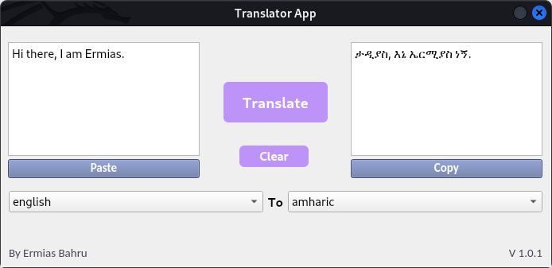

# Language translator GUI app

*A simple GUI application that translates over 100 languages using google translate api...*

---

**Screenshot:**

---

**Required libraries:**

1. `PyQt5` : is a Python binding of the cross-platform GUI toolkit Qt, implemented as a Python plug-in.

2. `googletrans` : a library that implemented Google Translate API.

3. `TextBlob` : a library for processing textual data.

---

**Library installation:**

1. `pip install PyQt5`
2. `pip install googletrans`
3. `pip install textblob`

---

**How to run:**

1. clone this repository
2. run main.py i.e  `python main.py`

---

**Todos:**

- [ ] make a function for the copy and paste button*